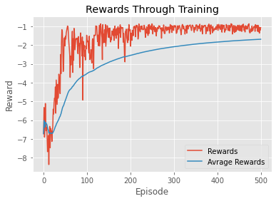
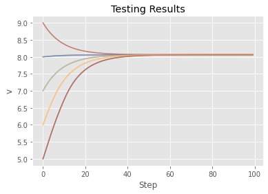
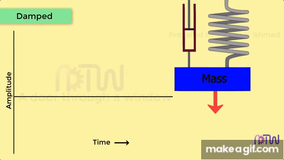
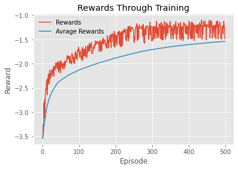

# Dynamical-Systems-Environments

  Various dynamical systems environments for designing, training and testing control and reinforcement learning algorithms.

# Cruise Control

  Given the first order differential equation descibing the velocity of some vehicle on a flat surface:

$$m\dot{v}+cv=F$$

  Where $v$ is the velocity of the vehicle, $m$ the mass, $c$ the momentum loss due to air resistance or surface friction, and $F$ the force generated by the engine. The simplified control system, where the control is given by $u$, is given by the equation:

$$\dot{v}+cv=u$$

  The default value of $c$ is 0.02. Being $v_0$ the target velocity (8 by default), the reward function if given by:

$$r(v,u) = -0.1\|u\| - \||v-v_0\||_2$$

  The system is simulated using Euler's method with timestep of 0.001 by default. Each episode is 100 timesteps. The observation and action space are $\mathbb{R}$.

  

  The following plots are examples of the results of the training of a Deep Deterministic Policy Gradient algorithm (DDPG) using Pytorch:

  
  

# Mass-Spring-Damper Model

  

 The homogeneous equation for the mass-spring-damper model is given by   
  
  $$\ddot{x} +\frac{c}{m} \dot{x} + \frac{k}{m} x =0$$
  
 
 Here $m$ is the mass, $c$ the dampening coeficient and $k$ the spring's stiffness. Taking $m=1$ and adding an external force $(u)$ as the control we get the simplified model: 
  
  $$\ddot{x} +c \dot{x} + k x =u$$

  The default parameters in the model are $c=1$, $k=5$, and the simulation timestep is $0.1$. In this system, the objective is to stop the movement at some given point $x_0$, (default being $x_0=2$). The Reward function is given by:

  $$r(x,u) = -0.1\|u\| - \| \dot{x} \| - \||x-x_0\||_2 $$

  Results of a DDPG agent in the system:

  

  
  
  

 

