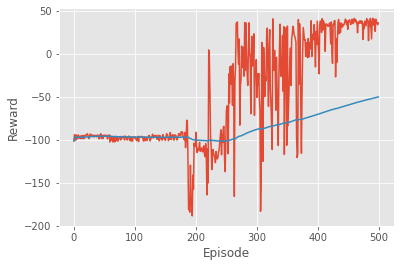

# Dynamical-Systems-Environments
Various dynamical systems environments for designing, training and testing control and reinforcement learning algorithms.

# Cruise Control

Given the first order differential equation descibing the velocity of some vehicle on a flat surface:

$$m\dot{v}+cv=F$$

Where $v$ is the velocity of the vehicle, $m$ the mass, $c$ the momentum loss due to air resistance or surface friction, and $F$ the force generated by the engine. The simplified control system, where the control is given by $u$, is given by the equation:

$$\dot{v}+cv=u$$

The default value of $c$ is 0.02. Being $v_0$ the target velocity (8 by default), the reward function if given by:

$$r(v) = -\||u\||^2_2 + \begin{cases}100 & v=v_0 \\
-100 & v \neq v_0
\end{cases}$$

The system is simulated using Euler's method with timestep of 0.001 by default. Each episode is 100 timesteps. The observation and action space are $\mathbb{R}$.

  

The following plots are examples of the results of the training of a Deep Deterministic Policy Gradient algorithm using Pytorch:

  
  

